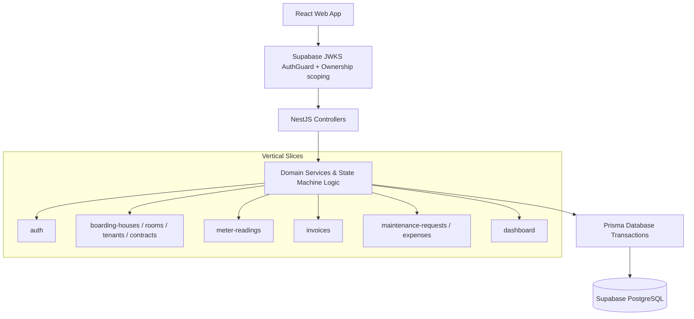

# RentalHub — Hệ thống Quản lý Nhà Trọ & Cho Thuê (NestJS & PostgreSQL)

> **Full-stack rental management: NestJS API + React web app, thiết kế mobile-first responsive.**
> *Domain-driven boarding house management system built with NestJS, TypeScript, Prisma ORM, PostgreSQL (Supabase), React and Vite.*

[](https://nestjs.com)
[](https://typescriptlang.org)
[](https://prisma.io)
[](https://postgresql.org)
[](https://swagger.io)
[](https://react.dev)

---

## 📌 Motivation & Rearchitecture Story

**RentalHub** bắt nguồn từ một vấn đề vận hành rất thật: quản lý nhà trọ và phòng cho thuê bằng sổ tay giấy.

Sau một prototype đầu tiên nằm ở repository kèm theo ([`../boarding-house-manager/`](../boarding-house-manager/)), repo này được viết lại theo hướng **kiến trúc production-oriented với NestJS**. Phần viết lại tập trung vào:

1. **Vertical Slice Architecture & Dependency Injection** — mỗi feature là một module độc lập, không để lẫn business logic giữa các module: `auth`, `boarding-houses`, `rooms`, `tenants`, `contracts`, `meter-readings`, `invoices`, `maintenance-requests`, `expenses`, `dashboard`, `health`.
2. **Strict Financial Data Types** — mọi khoản tiền đều là **integer VND**, không dùng float, để tránh sai số do làm tròn.
3. **State Machine Lifecycles** — chuyển trạng thái hóa đơn `DRAFT → ISSUED → PAID` (hoặc `VOID`) và yêu cầu bảo trì `OPEN → IN_PROGRESS → RESOLVED / CANCELLED` đều được kiểm tra ở server, trong `$transaction`.
4. **Ownership Security** — `AuthGuard` verify Supabase JWT bằng JWKS, mọi query đều scope theo `ownerId`, nên một chủ nhà không thể chạm vào nhà trọ, phòng, hợp đồng hay hóa đơn của chủ nhà khác. Đơn vị cô lập là **tài khoản chủ nhà**, không phải mô hình multi-tenant SaaS.
5. **Invoices & Utilities** — tính tiền điện nước hằng tháng từ chỉ số meter, vòng đời hóa đơn Draft → Issued → Paid → Void, và dashboard tổng hợp.

---

## 📐 System Architecture & Module Structure



API **không có global prefix** — route gốc là `/rooms`, `/invoices`, ... và **không có endpoint đăng nhập** (xem [Luồng xác thực](#-luồng-xác-thực--không-có-endpoint-login)).

---

## ⚙️ Key Technical Features

1. **Invoice State Machine & Monotonic Meter Validation**
   - Chỉ số mới không được thấp hơn chỉ số kỳ trước (kiểm tra ở cả `POST /meter-readings` và `POST /invoices`).
   - Hóa đơn snapshot `rentAmount`, `electricityUsage`/`electricityUnitPrice`, `waterUsage`/`waterUnitPrice` ngay lúc tạo, nên đổi đơn giá sau đó không làm thay đổi hóa đơn cũ.
   - Ràng buộc `@@unique([contractId, month, year])` chặn trùng hóa đơn cùng kỳ.
2. **Ownership Isolation on every read and write** — service nhận `authUserId`, resolve ra `User` nội bộ rồi scope mọi query; trả `404` (không phải `403`) khi tài nguyên không thuộc owner, để không lộ sự tồn tại của dữ liệu người khác.
3. **Automated Testing & API Specs** — **21 unit test suite** (Jest) cho service/controller/guard, **12 e2e test suite** (Supertest) chạy qua HTTP thật, **13 frontend test suite** (Vitest + RTL), và tài liệu OpenAPI tương tác tại `/docs`. Suite e2e `auth-guard.e2e-spec.ts` boot app với guard JWKS thật để chứng minh mọi route protected trả 401 khi thiếu token.

> Các state transition (`DRAFT → ISSUED → PAID`, `VOID`, và vòng đời maintenance request) được kiểm tra bằng **conditional write**: điều kiện trạng thái nằm trong `WHERE` của chính lệnh `UPDATE`, bên trong `$transaction`. Postgres re-evaluate điều kiện sau khi giành row lock, nên hai request chạy song song không thể cùng thắng. Nhờ vậy một hóa đơn `PAID` không bao giờ có thể bị đổi ngược thành `VOID`.

---

## 🚀 Quick Start (Local Setup)

### Prerequisites

- Node.js LTS (khuyến nghị 20+ cho NestJS 11) và `npm`.
- Một project Supabase (free tier là đủ) — cần Postgres database + Auth (email/password).

### 1. NestJS Backend Setup (`api/`)

```bash
cd api
cp .env.example .env
# điền các biến bắt buộc bên dưới vào .env
npm install
npm run db:generate
npm run db:migrate
npm run start:dev
```

| Biến | Bắt buộc | Mô tả |
|------|-----------|--------|
| `SUPABASE_URL` | ✅ | Origin HTTPS của project Supabase. Dùng để build JWKS URL và kiểm tra `issuer` của JWT. |
| `DATABASE_URL` | ✅ | PostgreSQL connection URL (`postgres://` hoặc `postgresql://`). |
| `DIRECT_URL` | ✅ | Connection URL dùng cho Prisma CLI — `api/prisma.config.ts` lấy `datasource.url` từ biến này khi chạy `migrate`/`generate`. |
| `PORT` | ⬜ | Default `3000`. Phải là số nguyên 1–65535. |
| `CORS_ORIGINS` | ⬜ | Danh sách origin cách nhau bởi dấu phẩy. Default `http://localhost:5173`; **bắt buộc** khi `NODE_ENV=production`; không chấp nhận `*`. |
| `NODE_ENV` | ⬜ | `development` \| `test` \| `production`. Quyết định file env được nạp: `.env.<NODE_ENV>` trước, fallback `.env`. |

✅ **Success Signal:**
* API chạy tại `http://localhost:3000`
* Swagger UI tại `http://localhost:3000/docs`
* `curl http://localhost:3000/health` trả `{"status":"ok"}` (endpoint duy nhất không cần token)

### 2. React Frontend Setup (`web/`)

Tạo file `web/.env` (repo này **không** có `web/.env.example`):

```dotenv
VITE_SUPABASE_URL=https://<project-ref>.supabase.co
VITE_SUPABASE_ANON_KEY=<anon key>
VITE_API_URL=http://localhost:3000   # optional, default http://localhost:3000
```

```bash
cd web
npm install
npm run dev
```

✅ **Success Signal:** mở `http://localhost:5173` (origin này đã nằm trong CORS mặc định của API) và đăng nhập bằng tài khoản Supabase.

---

## 🔐 Luồng xác thực (không có endpoint login)

`api/src/auth/auth.controller.ts` chỉ có **hai** endpoint, và **cả hai đều yêu cầu Bearer token**:

| Method | Path | Mô tả |
|--------|------|-------|
| `POST` | `/auth/bootstrap` | Upsert application `User` từ tài khoản Supabase hiện tại (`role: OWNER` khi tạo mới). |
| `GET` | `/auth/me` | Trả về application `User` đang đăng nhập. |

Token **không** do API cấp — frontend lấy trực tiếp từ Supabase:

```text
1. LoginPage -> POST {SUPABASE_URL}/auth/v1/token?grant_type=password
   headers: apikey: VITE_SUPABASE_ANON_KEY
   -> { access_token, refresh_token, expires_in }

2. Lưu access_token vào localStorage["access_token"]

3. Axios request interceptor gắn "Authorization: Bearer <access_token>"
   cho mọi request tới API (web/src/api/client.ts)

4. AuthGuard verify JWT bằng Supabase JWKS (issuer {SUPABASE_URL}/auth/v1,
   audience "authenticated"), gán request.user.id = JWT sub

5. AuthService.requireApplicationUser(sub) tra User nội bộ theo authUserId.
   Chưa bootstrap -> 403. Tài nguyên không thuộc owner -> 404.

6. Response interceptor: 401 -> xoá token, chuyển hướng /login
```

> ⚠️ Không có refresh token flow: `refresh_token` chỉ xuất hiện trong type, không được dùng ở đâu. Access token hết hạn thì người dùng phải đăng nhập lại.

---

## 🗺️ API Endpoints

Không có global prefix. **Mọi route trừ `/health` đều cần `Authorization: Bearer <access_token>`.**

| Module | Endpoints |
|--------|-----------|
| `health` | `GET /health` *(public)* |
| `auth` | `POST /auth/bootstrap`, `GET /auth/me` |
| `boarding-houses` | `GET /`, `GET /:id`, `POST /`, `PATCH /:id`, `DELETE /:id` |
| `rooms` | `GET /`, `GET /:id`, `POST /`, `PATCH /:id`, `DELETE /:id` |
| `tenants` | `GET /`, `GET /:id`, `POST /`, `PATCH /:id`, `DELETE /:id` |
| `contracts` | `GET /` (filter `?status=`), `GET /:id`, `POST /`, `POST /:id/end` |
| `meter-readings` | `GET /` (filter theo `roomId`, `month`, `year`), `POST /` |
| `invoices` | `GET /`, `GET /:id`, `POST /`, `POST /:id/issue`, `POST /:id/pay`, `POST /:id/void` |
| `maintenance-requests` | `GET /`, `GET /:id`, `POST /`, `DELETE /:id`, `PATCH /:id/start`, `PATCH /:id/resolve`, `PATCH /:id/cancel` |
| `expenses` | `GET /`, `GET /:id`, `POST /` |
| `dashboard` | `GET /` (aggregate server-side) |

### Body của các request `POST`

| Endpoint | Body |
|----------|------|
| `/boarding-houses` | `{ name, address }` |
| `/rooms` | `{ code, rentAmount, houseId }` |
| `/tenants` | `{ name, phone, identityNumber? }` |
| `/contracts` | `{ roomId, tenantId, startsAt, deposit }` |
| `/meter-readings` | `{ roomId, month, year, electricity, water }` |
| `/invoices` | `{ contractId, month, year }` |
| `/maintenance-requests` | `{ roomId, tenantId?, title, description }` |
| `/maintenance-requests/:id/resolve` | `{ chargeTo: "OWNER" \| "TENANT", estimatedCost?, actualCost? }` |
| `/expenses` | `{ boardingHouseId, maintenanceRequestId?, category, title, description?, amount, spentAt }` |

> Toàn bộ DTO validate bằng `class-validator` với global `ValidationPipe({ whitelist: true, forbidNonWhitelisted: true, transform: true })` — field lạ trong body sẽ bị `400`.

---

## 🧪 Testing & API Demonstration

```bash
# --- api/ ---
cd api
npm run db:migrate:test   # deploy migrations với NODE_ENV=test (đọc .env.test)
npm run test              # unit tests (Jest, chạy trên src/**/*.spec.ts)
npm run test:cov          # unit tests + coverage -> api/coverage/
npm run test:e2e          # e2e tests (Supertest) -- XEM CẢNH BÁO BÊN DƯỚI

# --- web/ ---
cd ../web
npm run test:run          # Vitest + RTL, chạy một lần rồi thoát
npm run test:coverage     # coverage -> web/coverage/
```

> ⚠️ **`npm run test:e2e` sẽ `TRUNCATE` toàn bộ 10 bảng trước mỗi test** (`resetDatabase()` trong `api/test/setup-e2e.ts`) và `.env.test` trỏ tới cùng database local dùng cho dev. Chạy e2e sẽ **xoá sạch dữ liệu local**. Đừng trỏ `.env.test` vào database nào bạn cần giữ.

`api/requests.http` là file kịch bản REST Client (VS Code) đi hết flow thật — dùng `@name` để tái sử dụng token giữa các request.

### Ví dụ flow bằng cURL

```bash
SUPABASE_URL="https://<project-ref>.supabase.co"
SUPABASE_ANON_KEY="<anon key>"
BASE="http://localhost:3000"

# 1. Lấy access token từ Supabase (KHÔNG gọi API này)
curl -s -X POST "$SUPABASE_URL/auth/v1/token?grant_type=password" \
  -H "apikey: $SUPABASE_ANON_KEY" \
  -H "Content-Type: application/json" \
  -d '{"email":"<email>","password":"<password>"}'

TOKEN="<access_token>"

# 2. Provision application user (bắt buộc trước khi gọi resource)
curl -X POST "$BASE/auth/bootstrap" -H "Authorization: Bearer $TOKEN"

# 3. Boarding house
curl -X POST "$BASE/boarding-houses" \
  -H "Authorization: Bearer $TOKEN" -H "Content-Type: application/json" \
  -d '{"name":"An Tam Boarding House","address":"123 Nguyen Trai, District 1"}'

# 4. Room (rentAmount = integer VND)
curl -X POST "$BASE/rooms" \
  -H "Authorization: Bearer $TOKEN" -H "Content-Type: application/json" \
  -d '{"code":"A101","rentAmount":3000000,"houseId":"<HOUSE_ID>"}'

# 5. Tenant
curl -X POST "$BASE/tenants" \
  -H "Authorization: Bearer $TOKEN" -H "Content-Type: application/json" \
  -d '{"name":"Nguyen Van A","phone":"0901234567","identityNumber":"079123456789"}'

# 6. Contract
curl -X POST "$BASE/contracts" \
  -H "Authorization: Bearer $TOKEN" -H "Content-Type: application/json" \
  -d '{"roomId":"<ROOM_ID>","tenantId":"<TENANT_ID>","startsAt":"2026-07-01T00:00:00.000Z","deposit":3000000}'

# 7. Meter reading (chỉ số phải >= kỳ trước)
curl -X POST "$BASE/meter-readings" \
  -H "Authorization: Bearer $TOKEN" -H "Content-Type: application/json" \
  -d '{"roomId":"<ROOM_ID>","month":7,"year":2026,"electricity":123456,"water":654321}'

# 8. Tạo hóa đơn tháng — theo CONTRACT, không phải theo room
curl -X POST "$BASE/invoices" \
  -H "Authorization: Bearer $TOKEN" -H "Content-Type: application/json" \
  -d '{"contractId":"<CONTRACT_ID>","month":7,"year":2026}'

# 9. Vòng đời hóa đơn: DRAFT -> ISSUED -> PAID  (hoặc VOID)
curl -X POST "$BASE/invoices/<INVOICE_ID>/issue" -H "Authorization: Bearer $TOKEN"
curl -X POST "$BASE/invoices/<INVOICE_ID>/pay"   -H "Authorization: Bearer $TOKEN"
```

---

## 📂 Repository Layout

```text
boarding-house-manager-nestjs-rmk/
├── api/                              # NestJS Backend Application
│   ├── src/                          # Vertical slices: auth, boarding-houses, rooms,
│   │                                 #   tenants, contracts, meter-readings, invoices,
│   │                                 #   maintenance-requests, expenses, dashboard, health
│   │                                 #   + config/, prisma/, common/, generated/prisma/
│   ├── prisma/                       # schema.prisma + migrations/
│   ├── prisma.config.ts              # Prisma 7 config (datasource.url = DIRECT_URL)
│   ├── test/                         # 12 e2e specs + shared harness (setup-e2e.ts, jest-e2e.json)
│   ├── specs/                        # 9 tài liệu API spec dạng markdown
│   └── coverage/                     # Báo cáo coverage gần nhất (sinh bởi npm run test:cov)
├── web/                              # React 19 + Vite + TanStack Query Frontend
│   ├── src/                          # pages/ (10 trang + login), api/, components/, hooks/
│   ├── tailwind.config.js            # Design tokens (màu, font, radius)
│   └── vite.config.ts                # Cấu hình Vite + Vitest (jsdom, TZ Asia/Ho_Chi_Minh)
└── README.md
```

> Hai thư mục này có chủ ý **không** nằm trong git: `docs/` (learning notes tiếng Việt + ADR), `LEARNING_PATH.md`, `api/specs/`, `api/requests.http` và file rule của AI agent. Chúng là tài liệu local; người đọc trên GitHub chỉ thấy `api/`, `web/` và README này.

---

## 🧮 Số liệu hiện tại

| Hạng mục | Số liệu |
|----------|---------|
| Backend unit tests | 21 suite / 200 test (`api/src/**/*.spec.ts`, chạy pass 2026-09-29) |
| Backend e2e tests | 12 suite / 80 test (`api/test/*.e2e-spec.ts`, chạy trên Supabase 2026-09-29) |
| Frontend tests | 13 suite / 87 test (`web/src/**/*.test.tsx`, Vitest + RTL, pass 2026-09-29) |
| Backend coverage | 79.59% statements, 75.8% branches, 83.04% functions *(chạy 2026-09-29)* |
| Frontend coverage | 65.88% statements, 52.1% branches, 46.36% functions *(chạy 2026-09-29)* |

> Backend: 9 domain service đều đạt 100% statements; `invoices.service.ts` 100% stmts / 94.11% branch, `maintenance-requests.service.ts` 100% / 94.87%. Tổng số bị kéo xuống bởi `main.ts`, `*.module.ts`, `health/`, `auth.controller.ts` và `config.service.ts` — những chỗ không unit-test được.
> Frontend: các test hiện tập trung vào filter/search/responsive/modal, nên các page có nhiều modal CRUD (`BoardingHousesPage` 37.7%, `TenantsPage` 41.5%, `InvoicesPage` 55.4%) còn thấp.

---

## 📄 License & Provenance Notice

This repository is an **independent software project** created by Vo Quang Huy. It is designed for technical demonstration and real-world workflow automation. No confidential credentials or proprietary third-party code are included.

Prototype đi kèm ở [`../boarding-house-manager/`](../boarding-house-manager/) là một codebase riêng biệt, không nằm trong phạm vi repo này.

---

## ⚠️ Known Limitations

Đây là các hạn chế đã biết, không phải hành vi bị giấu. Chúng được liệt kê để người review không phải đọc code mới tìm ra.

* **No pagination.** Không endpoint `GET` nào có phân trang — mỗi list trả về toàn bộ tập kết quả của owner. Với vài chục phòng thì ổn; quy mô lớn hơn sẽ cần cursor pagination.
* **Tenant-paid repairs are not recorded anywhere.** Khi resolve một maintenance request với `chargeTo: TENANT`, hệ thống **không** tạo `Expense` và **không** thêm vào hóa đơn — khoản đó được thu ngoài hệ thống. UI có giải thích rõ điều này cho người dùng, nhưng xét về kế toán thì request chỉ còn giá trị làm lịch sử sửa chữa của phòng.
* **No refresh token.** Frontend không lưu/luân chuyển `refresh_token`. Access token hết hạn thì phải đăng nhập lại.
* **E2E tests wipe the local database.** `resetDatabase()` `TRUNCATE` cả 10 bảng trước mỗi spec, và `.env.test` dùng chung database local với dev. Chạy `npm run test:e2e` là mất dữ liệu dev.
* **No dedicated e2e spec for expenses.** `POST/GET /expenses` chỉ được phủ gián tiếp trong `ownership.e2e-spec.ts`, chưa có suite CRUD riêng.
* **No message queue or background job processing.** Không có BullMQ, không có queue worker. Việc lẽ ra nên chạy nền (gửi thông báo, xuất PDF hóa đơn) đang chạy inline trong request.
* **No request-context or tenant-context middleware.** Không có `AsyncLocalStorage`. Owner isolation phụ thuộc việc lặp lại `ownerId` scope trong từng service method — một query quên scope sẽ rò dữ liệu mà không có cảnh báo.
* **No Playwright suite.** `tests/visual-audit.cjs` là script chụp màn hình để soi layout ở nhiều viewport, không phải test tự động. Cả `api/package.json` và `web/package.json` đều không có dependency Playwright. Bằng chứng test thật là các suite Jest/Vitest nêu trên.
* **No Telegram bot.** `/bill` webhook và receipt formatting không tồn tại trong codebase NestJS này.
* **No room-transfer workflow.** Chuyển khách sang phòng khác (nhiều transaction trong prototype) chưa được port sang đây. Module `contracts` và `rooms` đã có và đã test, nhưng không có operation transfer.
