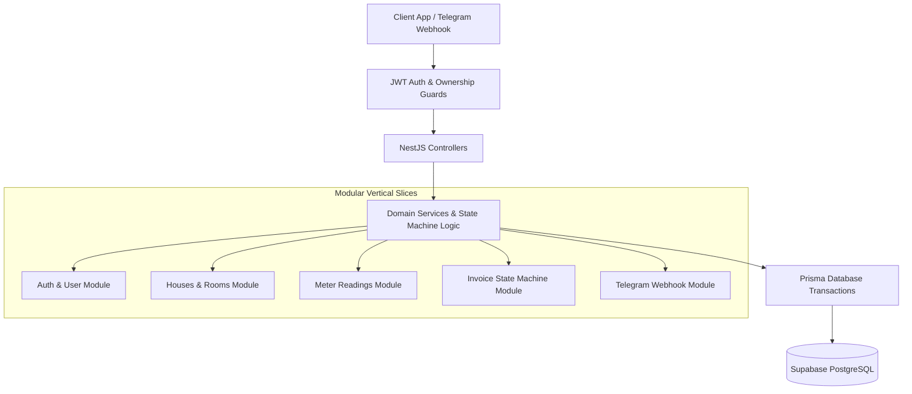

# RentalHub — Boarding House & Rental Property Management System (NestJS & PostgreSQL)

> **NestJS Backend Rearchitecture Workspace (In Progress)**  
> *A domain-driven rental management backend and mobile-first PWA built with NestJS, TypeScript, Prisma ORM, PostgreSQL (Supabase), and Telegram Bot Integration.*

[](https://nestjs.com)
[](https://typescriptlang.org)
[](https://prisma.io)
[](https://postgresql.org)
[](https://swagger.io)

---

## 📌 Motivation & Rearchitecture Story

**RentalHub** originated from a real-world operational pain point: managing small boarding houses and rental rooms using manual, handwritten paper records. 

After building an initial full-stack prototype in Express.js ([`boarding-house-manager`](../boarding-house-manager/)), this repository was created as a **production-oriented architectural rewrite in NestJS**. The rewrite explores:
1. **Vertical Slice Architecture & Dependency Injection**: Enforcing clear module boundaries (`auth`, `houses`, `rooms`, `tenants`, `meters`, `invoices`, `maintenance`).
2. **Strict Financial Data Types**: Handling all monetary amounts in **integer VND** to prevent floating-point rounding errors.
3. **State Machine Lifecycles**: Strict invoice state transitions (`DRAFT → ISSUED → PAID`) and maintenance request lifecycles (`OPEN → IN_PROGRESS → RESOLVED`).
4. **Ownership Security**: Multi-tenant authorization guards enforcing that landlords can only access and modify their own properties.
5. **Telegram Bot Webhook**: Integrating Telegram `/bill` commands for instant tenant invoice lookups and notification delivery.

---

## 📐 System Architecture & Module Structure



---

## ⚙️ Key Technical Features

1. **Invoice State Machine & Monotonic Meter Validation**
   - Meter readings enforce strict increasing constraints (new reading must be $\ge$ previous reading).
   - Invoices snapshots electricity/water unit rates at issuance time and transition safely: `DRAFT → ISSUED → PAID`.
   - Single invoice per room/month constraint to prevent duplicate billings.
2. **Room Transfer & Contract Lifecycle**
   - Executed within database transactions to update tenant room assignments, finalize old room utility balances, and initialize new contract deposits.
3. **Telegram Bot Integration (`/bill`)**
   - Webhook handler authenticating `TELEGRAM_CHAT_ID`, fetching current room invoice status, and formatting instant copyable text receipts for messaging apps.
4. **Automated Testing & API Specs**
   - Includes Playwright integration test scripts, NestJS unit tests, and interactive Swagger OpenAPI documentation (`/api/docs`).

---

## 🚀 Quick Start (Local Setup)

### Prerequisites
* Node.js 18+ and `npm` installed.
* PostgreSQL database instance (or local PostgreSQL / Supabase).

### 1. NestJS Backend Setup (`api/`)

```bash
# Clone repository and navigate to API directory
cd boarding-house-manager-nestjs-rmk/api

# Copy environment example
cp .env.example .env

# Install dependencies
npm install

# Push database schema via Prisma
npx prisma db push

# Start NestJS development server
npm run start:dev
```

✅ **Success Signal:** 
* NestJS API starts at `http://localhost:5005`
* Swagger Interactive API Docs available at `http://localhost:5005/api/docs`

### 2. React Frontend Setup (`web/`)

To run the mobile-first React + Vite management dashboard:
```bash
# Navigate to web directory
cd boarding-house-manager-nestjs-rmk/web

# Install dependencies
npm install

# Start Vite development server
npm run dev
```

---

## 🧪 Testing & API Demonstration

### Run NestJS Unit & E2E Tests
```bash
cd api
npm run test
npm run test:e2e
```

### Example API Flow via cURL

#### 1. Authenticate & Obtain JWT Token
```bash
curl -X POST http://localhost:5005/api/auth/login \
     -H "Content-Type: application/json" \
     -d '{"email": "landlord@example.com", "password": "password123"}'
```

#### 2. Create Meter Reading (Electricity / Water)
```bash
curl -X POST http://localhost:5005/api/meters/readings \
     -H "Authorization: Bearer <YOUR_JWT_TOKEN>" \
     -H "Content-Type: application/json" \
     -d '{"roomId": "UUID_ROOM_101", "electricityReading": 150, "waterReading": 45, "readingDate": "2026-08-01"}'
```

#### 3. Generate Monthly Invoice
```bash
curl -X POST http://localhost:5005/api/invoices/generate \
     -H "Authorization: Bearer <YOUR_JWT_TOKEN>" \
     -H "Content-Type: application/json" \
     -d '{"roomId": "UUID_ROOM_101", "month": 8, "year": 2026}'
```

---

## 📂 Repository Layout

```text
boarding-house-manager-nestjs-rmk/
├── api/                           # NestJS Backend Application
│   ├── src/                       # Domain modules (auth, houses, rooms, tenants, meters, invoices, etc.)
│   ├── prisma/                    # PostgreSQL schema definition & migrations
│   └── test/                      # E2E testing specs
├── web/                           # React + TypeScript + Vite Frontend Application
│   ├── src/                       # React components, pages, API clients & hooks
│   └── public/                    # Static assets & icons
└── README.md                      # Project documentation
```

---

## 📄 License & Provenance Notice

This repository is an **independent software project** created by Vo Quang Huy. It is designed for technical demonstration and real-world workflow automation. No confidential credentials or proprietary third-party code are included.
