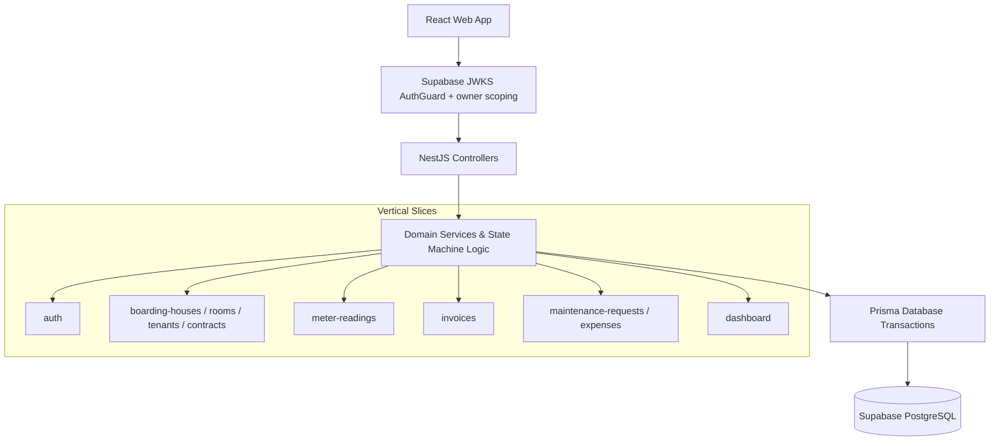

# RentalHub — Boarding House & Rental Management System

> **Full-stack rental management: a NestJS API with a mobile-first React admin app.**
> *Domain-driven boarding house management built with NestJS, TypeScript, Prisma ORM, PostgreSQL (Supabase), React and Vite.*

[](https://nestjs.com)
[](https://typescriptlang.org)
[](https://prisma.io)
[](https://postgresql.org)
[](https://swagger.io)
[](https://react.dev)

---

## Why this exists

Small boarding houses are still run on paper. This is a rewrite, in NestJS, of an
earlier Express version of the same product, done to explore the things a
paper ledger cannot enforce:

1. **Vertical slice architecture with real dependency injection** — one Nest
   module per feature, no business logic leaking between them: `auth`,
   `boarding-houses`, `rooms`, `tenants`, `contracts`, `meter-readings`,
   `invoices`, `maintenance-requests`, `expenses`, `dashboard`, `health`.
2. **Money as integer VND** — no floats anywhere, so no rounding surprises.
3. **Lifecycle state machines** — invoice `DRAFT → ISSUED → PAID` (with `VOID`
   as the exit branch) and maintenance request `OPEN → IN_PROGRESS →
   RESOLVED / CANCELLED`, both enforced server-side.
4. **Owner isolation** — a Supabase JWKS guard resolves the landlord on every
   request and every query is scoped to that owner, so one landlord can never
   reach another's houses, rooms, contracts or invoices. The unit of isolation
   is the owner account, not a multi-tenant SaaS model.
5. **Automated utility billing** — monthly electricity and water charges are
   computed from meter readings when an invoice is issued, with a server-side
   dashboard on top.

---

## System architecture



The API has **no global prefix** — routes live at `/rooms`, `/invoices`, … — and
has **no login endpoint** (see [Authentication](#authentication)).

---

## Key technical decisions

**State transitions are conditional writes, not check-then-update.** The
allowed source `status` lives in the `WHERE` clause of the `UPDATE` itself,
inside a `$transaction`. Postgres re-evaluates the predicate after acquiring the
row lock, so two concurrent requests cannot both match. A read-then-write
(`findFirst`, then `update` by `id`) would let both through, and a `pay` racing
a `void` could flip a collected invoice back to `VOID`.

```ts
const { count } = await tx.invoice.updateMany({
  where: { id, status: InvoiceStatus.ISSUED, /* + owner scope */ },
  data: { status: InvoiceStatus.PAID, paidAt: new Date() },
});
if (count === 0) throw new ConflictException(/* current status */);
```

**Utility billing is computed at invoice time.** Usage is
`current reading − previous reading` for the room, priced at the house's unit
prices and **snapshotted onto the invoice**, so changing a price later never
alters an existing bill. A `@@unique([contractId, month, year])` constraint
makes duplicate billing for a period impossible.

**DTOs are validated at the boundary.** A global
`ValidationPipe({ whitelist: true, forbidNonWhitelisted: true, transform: true })`
strips unknown keys and rejects the request, so an unexpected field never
reaches a service.

**Owner scoping returns 404, not 403.** A resource that does not exist and one
owned by someone else produce the same response, so the API does not leak the
existence of other landlords' data.

---

## Quick start

### Prerequisites

- Node.js LTS (20+ recommended for NestJS 11) and npm.
- A Supabase project — Postgres database plus Auth with email/password.

### 1. Backend (`api/`)

```bash
cd api
cp .env.example .env
# fill in the required variables listed below
npm install
npm run db:generate
npm run db:migrate
npm run start:dev
```

| Variable | Required | Purpose |
|----------|----------|---------|
| `SUPABASE_URL` | yes | HTTPS origin of the Supabase project; builds the JWKS URL and the JWT `issuer` check. |
| `DATABASE_URL` | yes | PostgreSQL connection URL (`postgres://` or `postgresql://`). |
| `DIRECT_URL` | yes | Connection URL used by the Prisma CLI; `api/prisma.config.ts` reads `datasource.url` from it. |
| `PORT` | no | Defaults to `3000`. Integer between 1 and 65535. |
| `CORS_ORIGINS` | no | Comma-separated origins. Defaults to `http://localhost:5173`; **required** when `NODE_ENV=production`; `*` is rejected. |
| `NODE_ENV` | no | `development` \| `test` \| `production`. Decides which env file loads: `.env.<NODE_ENV>` first, `.env` as fallback. |

✅ **Success signals:** API listening on `http://localhost:3000`; Swagger UI at
`http://localhost:3000/docs`; `curl http://localhost:3000/health` returns
`{"status":"ok"}` (the only route that needs no token).

### 2. Frontend (`web/`)

Create `web/.env` (this repo does not ship a `web/.env.example`):

```dotenv
VITE_SUPABASE_URL=https://<project-ref>.supabase.co
VITE_SUPABASE_ANON_KEY=<anon key>
VITE_API_URL=http://localhost:3000   # optional, defaults to http://localhost:3000
```

```bash
cd web
npm install
npm run dev
```

✅ **Success signal:** `http://localhost:5173` opens (that origin is in the
API's default CORS list) and you can sign in with a Supabase account.

---

## Authentication

`api/src/auth/auth.controller.ts` exposes two routes, and **both require a
Bearer token**:

| Method | Path | Purpose |
|--------|------|---------|
| `POST` | `/auth/bootstrap` | Upserts the application `User` for the current Supabase account (`role: OWNER` on first call). |
| `GET` | `/auth/me` | Returns the application `User` currently signed in. |

The API never issues tokens. The frontend gets them from Supabase directly:

```text
1. LoginPage -> POST {SUPABASE_URL}/auth/v1/token?grant_type=password
   headers: apikey: VITE_SUPABASE_ANON_KEY
   -> { access_token, refresh_token, expires_in }

2. access_token is stored in localStorage["access_token"]

3. An axios request interceptor attaches "Authorization: Bearer <access_token>"
   to every call (web/src/api/client.ts)

4. AuthGuard verifies the JWT against the Supabase JWKS
   (issuer {SUPABASE_URL}/auth/v1, audience "authenticated")
   and sets request.user.id = JWT sub

5. AuthService.requireApplicationUser(sub) looks up the internal User by
   authUserId. Not bootstrapped yet -> 403. Resource not owned -> 404.

6. Response interceptor: 401 -> clear the token and redirect to /login
```

> ⚠️ There is no refresh-token flow: `refresh_token` exists in the type but is
> never used. When the access token expires the user must sign in again.

---

## API reference

No global prefix. **Every route except `/health` requires
`Authorization: Bearer <access_token>`.**

| Module | Endpoints |
|--------|-----------|
| `health` | `GET /health` *(public)* |
| `auth` | `POST /auth/bootstrap`, `GET /auth/me` |
| `boarding-houses` | `GET /`, `GET /:id`, `POST /`, `PATCH /:id`, `DELETE /:id` |
| `rooms` | `GET /`, `GET /:id`, `POST /`, `PATCH /:id`, `DELETE /:id` |
| `tenants` | `GET /`, `GET /:id`, `POST /`, `PATCH /:id`, `DELETE /:id` |
| `contracts` | `GET /` (filter `?status=`), `GET /:id`, `POST /`, `POST /:id/end` |
| `meter-readings` | `GET /` (filter by `roomId`, `month`, `year`), `POST /` |
| `invoices` | `GET /`, `GET /:id`, `POST /`, `POST /:id/issue`, `POST /:id/pay`, `POST /:id/void` |
| `maintenance-requests` | `GET /`, `GET /:id`, `POST /`, `DELETE /:id`, `PATCH /:id/start`, `PATCH /:id/resolve`, `PATCH /:id/cancel` |
| `expenses` | `GET /`, `GET /:id`, `POST /` |
| `dashboard` | `GET /` (server-side aggregate) |

### Request bodies for `POST`

| Endpoint | Body |
|----------|------|
| `/boarding-houses` | `{ name, address }` |
| `/rooms` | `{ code, rentAmount, houseId }` |
| `/tenants` | `{ name, phone, identityNumber? }` |
| `/contracts` | `{ roomId, tenantId, startsAt, deposit }` |
| `/meter-readings` | `{ roomId, month, year, electricity, water }` |
| `/invoices` | `{ contractId, month, year }` |
| `/maintenance-requests` | `{ roomId, tenantId?, title, description }` |
| `/maintenance-requests/:id/resolve` | `{ chargeTo: "OWNER" \| "TENANT", estimatedCost?, actualCost? }` |
| `/expenses` | `{ boardingHouseId, maintenanceRequestId?, category, title, description?, amount, spentAt }` |

A reading may never be lower than the previous period's reading; this is checked
on both `POST /meter-readings` and `POST /invoices`.

---

## Frontend

`web/` is a React 19 + Vite + TanStack Query app, mobile-first: every list screen
renders cards on phones and a table on desktop via `useMediaQuery`. The
dashboard is a single `GET /dashboard` call — the aggregation lives on the
server, not in the browser.

```bash
cd web
npm run dev            # Vite dev server on :5173
npm run build          # tsc -b && vite build — also the type check
npm run test:run       # Vitest + RTL, one shot
npm run test:coverage
```

---

## Testing

```bash
# --- api/ ---
cd api
npm run test            # unit tests (Jest, src/**/*.spec.ts)
npm run test:cov        # + coverage
npm run db:migrate:test # deploy migrations with NODE_ENV=test (reads .env.test)
npm run test:e2e        # e2e tests (Supertest) — see the warning below

# --- web/ ---
cd ../web
npm run test:run
npm run test:coverage
```

> ⚠️ **`npm run test:e2e` truncates all 10 tables before every test**
> (`resetDatabase()` in `api/test/setup-e2e.ts`) and `.env.test` currently
> points at the same database used for local development. Running the e2e suite
> will **delete your local data**.

| Suite | Count | Status |
|-------|-------|--------|
| Backend unit (`api/src/**/*.spec.ts`) | 21 suites / 200 tests | passing |
| Backend e2e (`api/test/*.e2e-spec.ts`) | 12 suites / 80 tests | passing on Supabase |
| Frontend (`web/src/**/*.test.tsx`) | 13 suites / 87 tests | passing |
| Backend coverage | 79.59% stmts, 75.8% branch, 83.04% funcs | all 9 domain services at 100% statements |
| Frontend coverage | 65.88% stmts, 52.1% branch, 46.36% funcs | tests focus on filter/search/responsive/modal |

Two e2e suites are worth knowing about: `auth-guard.e2e-spec.ts` boots the app
with the **real** JWKS guard (no override) and proves every protected route
returns 401 without a token, and `ownership.e2e-spec.ts` builds a full chain
for owner A and proves owner B cannot read or mutate any part of it.

---

## Example flow with cURL

```bash
SUPABASE_URL="https://<project-ref>.supabase.co"
SUPABASE_ANON_KEY="<anon key>"
BASE="http://localhost:3000"

# 1. Get an access token from Supabase (this API does not issue tokens)
curl -s -X POST "$SUPABASE_URL/auth/v1/token?grant_type=password" \
  -H "apikey: $SUPABASE_ANON_KEY" \
  -H "Content-Type: application/json" \
  -d '{"email":"<email>","password":"<password>"}'

TOKEN="<access_token>"

# 2. Provision the application user (required before any resource call)
curl -X POST "$BASE/auth/bootstrap" -H "Authorization: Bearer $TOKEN"

# 3. Boarding house
curl -X POST "$BASE/boarding-houses" \
  -H "Authorization: Bearer $TOKEN" -H "Content-Type: application/json" \
  -d '{"name":"An Tam Boarding House","address":"123 Nguyen Trai, District 1"}'

# 4. Room (rentAmount is integer VND)
curl -X POST "$BASE/rooms" \
  -H "Authorization: Bearer $TOKEN" -H "Content-Type: application/json" \
  -d '{"code":"A101","rentAmount":3000000,"houseId":"<HOUSE_ID>"}'

# 5. Tenant
curl -X POST "$BASE/tenants" \
  -H "Authorization: Bearer $TOKEN" -H "Content-Type: application/json" \
  -d '{"name":"Nguyen Van A","phone":"0901234567","identityNumber":"079123456789"}'

# 6. Contract (this also marks the room OCCUPIED)
curl -X POST "$BASE/contracts" \
  -H "Authorization: Bearer $TOKEN" -H "Content-Type: application/json" \
  -d '{"roomId":"<ROOM_ID>","tenantId":"<TENANT_ID>","startsAt":"2026-07-01T00:00:00.000Z","deposit":3000000}'

# 7. Meter reading (must be >= the previous period)
curl -X POST "$BASE/meter-readings" \
  -H "Authorization: Bearer $TOKEN" -H "Content-Type: application/json" \
  -d '{"roomId":"<ROOM_ID>","month":7,"year":2026,"electricity":123456,"water":654321}'

# 8. Create the monthly invoice — per CONTRACT, not per room
curl -X POST "$BASE/invoices" \
  -H "Authorization: Bearer $TOKEN" -H "Content-Type: application/json" \
  -d '{"contractId":"<CONTRACT_ID>","month":7,"year":2026}'

# 9. Invoice lifecycle: DRAFT -> ISSUED -> PAID  (or VOID from DRAFT/ISSUED)
curl -X POST "$BASE/invoices/<INVOICE_ID>/issue" -H "Authorization: Bearer $TOKEN"
curl -X POST "$BASE/invoices/<INVOICE_ID>/pay"   -H "Authorization: Bearer $TOKEN"
```

---

## Repository layout

```text
boarding-house-manager-nestjs-rmk/
├── api/                              # NestJS backend
│   ├── src/                          # vertical slices + config/, prisma/, common/
│   ├── prisma/                       # schema.prisma + migrations/
│   ├── prisma.config.ts              # Prisma 7 config (datasource.url = DIRECT_URL)
│   ├── test/                         # 12 e2e specs + shared harness (setup-e2e.ts, jest-e2e.json)
│   └── coverage/                     # latest coverage report (git-ignored)
├── web/                              # React 19 + Vite + TanStack Query frontend
│   ├── src/                          # pages/ (10 screens + login), api/, components/, hooks/
│   ├── tailwind.config.js            # design tokens (colour, font, radius)
│   └── vite.config.ts                # Vite + Vitest (jsdom, TZ Asia/Ho_Chi_Minh)
└── README.md
```

Personal learning material (`docs/learning/`, `docs/adr/`, `LEARNING_PATH.md`)
lives outside git on purpose; this README is the public documentation.

---

## License & provenance

This repository is an **independent software project** created by Vo Quang Huy,
built for technical demonstration and workflow automation. No confidential
credentials or proprietary third-party code are included.

---

## Known limitations

Listed openly so a reviewer does not have to read the code to find them.

* **No pagination.** No `GET` endpoint paginates — each list returns the
  owner's entire result set. Fine for a few dozen rooms; larger landlords would
  need cursor pagination.
* **Tenant-paid repairs are not recorded anywhere.** Resolving a maintenance
  request with `chargeTo: TENANT` creates no `Expense` and adds nothing to the
  invoice; the money is settled outside the system. The UI says so explicitly,
  but accounting-wise the request is only a repair history for the room.
* **No refresh token.** The frontend does not keep or rotate `refresh_token`.
* **E2E tests wipe the local database.** `resetDatabase()` truncates all 10
  tables before each spec and `.env.test` shares the dev database.
* **No dedicated e2e spec for expenses.** `POST/GET /expenses` is only covered
  indirectly through `ownership.e2e-spec.ts`.
* **No message queue or background jobs.** No BullMQ, no worker; notification
  delivery and PDF invoices would belong on one and currently run inline.
* **No request-scoped owner context.** No `AsyncLocalStorage`; owner isolation
  relies on repeating the `ownerId` scope in every service method, so a query
  that forgets it would leak silently.
* **Swagger is mounted in production too.** `/docs` is served unconditionally.
